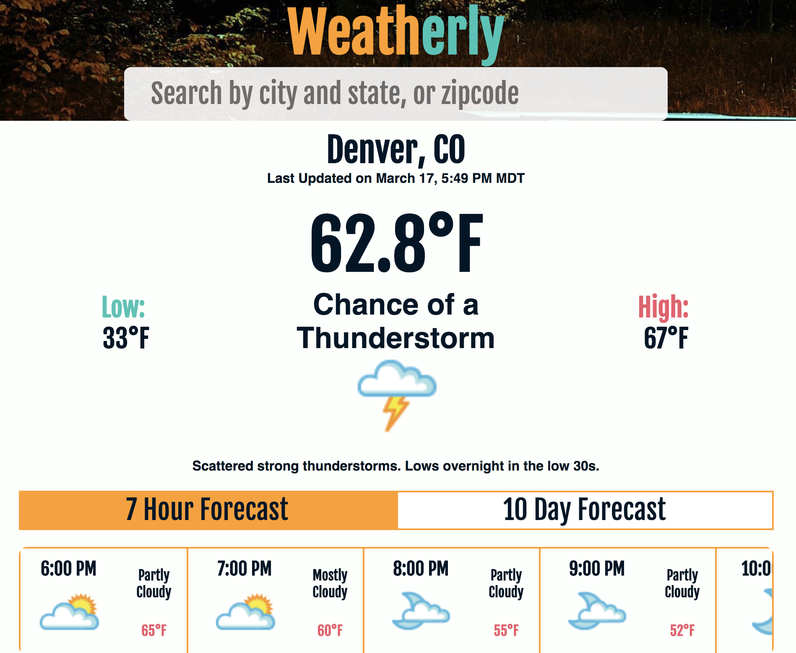

# Weatherly - Alex Bonder, Jordan Quinn - (FE Mod 2)

## Synopsis

This project was our first using React. React takes all the best parts of JavaScript and HTML and pushes them together. I found the component structure of React to make the whole project much easier to understand. Passing information around became much simpler. This project was also our first experience using an API we used the data from The Weather Underground to have live data for whichever city we looked up. We utilized the Complete-Me project to allow autocompletion of cities and zip codes. This project used all of the moving parts to create a weather app. 

## Project Goals

* Learn React
* Learn to consume and utilize data from an API
* Use propTypes to validate props passed to each component.
* Write meaningful, comprehensive unit and integration tests.

## Installation

This application was built using the `create-react-app` boilerplate. This boilerplate provides a lot of built in content and dependencies for free. The [documentation](https://github.com/facebookincubator/create-react-app) is avialable to read through.

To set up: 

Fork or clone this project

Run `npm install` from the root directory

You will need an API key from [WeatherUnderground](https://www.wunderground.com/)

In `/lib` add a file called `api-key.js`

Add the following...

```javascript
// /lib/api-key.js

export default '(your API key)';

// Remember to add this file to your .gitignore
```

Run `npm start` and visit localhost:8080 in your browser

You can begin running your tests with `npm test`

## Built With

React
[WeatherUnderground](https://www.wunderground.com/) API
[CompleteMe](https://github.com/lexbonder/complete-me) project for auto-complete in search bar.

## Tests

The tests are a compilation of unit and integration tests to simulate the methods and events happening in the application.

## Contributors

Alex Bonder [GitHub](https://github.com/lexbonder) [LinkedIn](https://www.linkedin.com/in/lexbonder/)

Jordan Quinn [GitHub](https://github.com/JordanPQuinn) [LinkedIn](https://www.linkedin.com/in/jordanpquinn/)

## Screenshots


